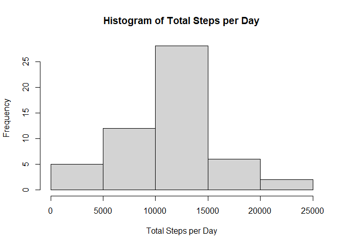
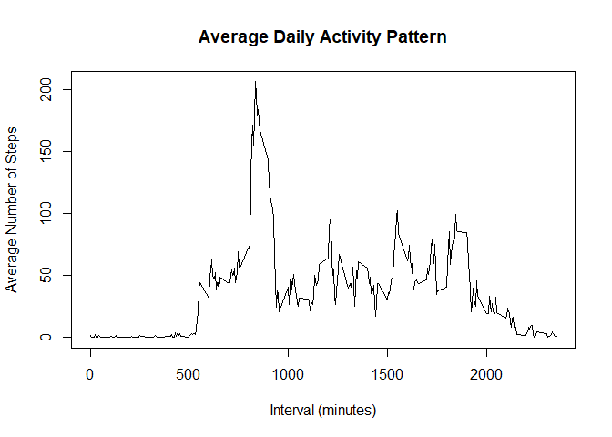
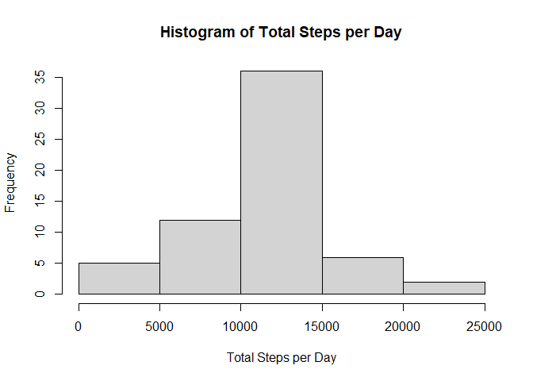
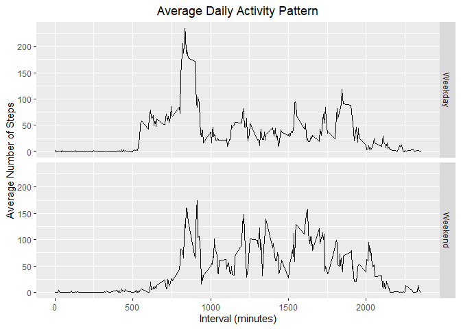

## Loading and preprocessing the data


```r
activity <- read.csv(unz("activity.zip", "activity.csv"), header=TRUE)
activity$date <- as.Date(activity$date, "%Y-%m-%d")
```

## What is mean total number of steps taken per day?


```r
stepsBydate <- aggregate(steps ~ date, activity, sum)
hist(stepsBydate$steps, xlab = "Total Steps per Day", main = "Histogram of Total Steps per Day")
```

<!-- -->


```r
meanStepsDate <- as.integer(mean(stepsBydate$steps, na.rm = TRUE))
```

The mean total number of steps taken per day is 10766.


```r
medianStepsDate <- as.integer(median(stepsBydate$steps, na.rm = TRUE))
```

The median total number of steps taken per day is 10765.

## What is the average daily activity pattern?


```r
stepsByinterval <- aggregate(steps ~ interval, activity, mean)
plot(stepsByinterval, type = "l", xlab = "Interval (minutes)", ylab = "Average Number of Steps", main = "Average Daily Activity Pattern")
```

<!-- -->


```r
maxInterval <- stepsByinterval[stepsByinterval$steps == max(stepsByinterval$steps),]$interval
```
The 5-minute interval, on average across all the days in the dataset, with the maximum number of steps is the 835-minute interval.

## Imputing missing values


```r
nMissing <- sum(is.na(activity[,1]))
```
There are 2304 missing values.

We can fill in the missing values with the mean for that 5-minute interval in a replica of the original dataset.


```r
activity2 <- activity

for (i in 1:nrow(activity2)) {
  if (is.na(activity2[i,1]) == TRUE) {
    activity2[i,1] <- stepsByinterval[which(stepsByinterval$interval == activity2[i,3]),2]
  }
}
```

Below, we have a histogram of the total number of steps taken each day.


```r
stepsBydate2 <- aggregate(steps ~ date, activity2, sum)
hist(stepsBydate2$steps, xlab = "Total Steps per Day", main = "Histogram of Total Steps per Day")
```

<!-- -->


```r
meanStepsDate2 <- as.integer(mean(stepsBydate2$steps, na.rm = TRUE))
```

The mean total number of steps taken per day is 10766.


```r
medianStepsDate2 <- as.integer(median(stepsBydate2$steps, na.rm = TRUE))
```

The median total number of steps taken per day is 10766.

There is a difference in the median total number of steps taken per day from the first part of the assignment, indicating that imputing missing data increases the median.

## Are there differences in activity patterns between weekdays and weekends?


```r
day <- weekdays(activity$date)
activity <- cbind(activity, day)

for (i in 1:nrow(activity)) {
  if (activity[i,4] %in% c("Saturday", "Sunday")) {
    activity[i,4] <- "Weekend"
  }
  else {
    activity[i,4] <- "Weekday"
  }
}

stepsByintervalWeek <- aggregate(steps ~ interval + day, activity, mean)

library(ggplot2)

ggplot(data = stepsByintervalWeek, aes(x = interval, y = steps)) + geom_line() + facet_grid(day ~ .) + ggtitle("Average Daily Activity Pattern") + xlab("Interval (minutes)") + ylab("Average Number of Steps") + theme(plot.title = element_text(hjust = 0.5))
```

<!-- -->

From the plot, there are clear differences in average daily activity patterns between weekdays and weekends.
